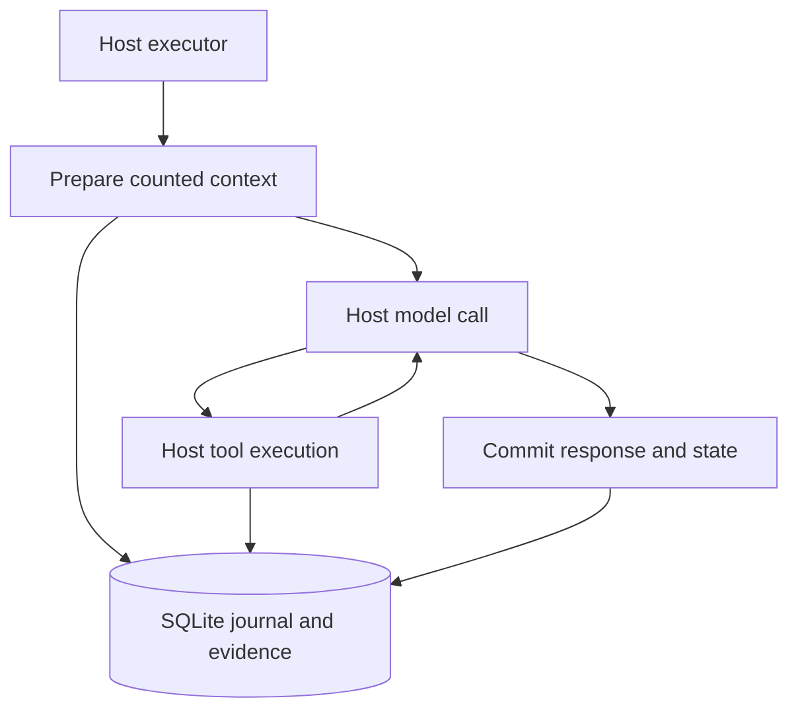

# Context Memory Path: Memory Inside the Harness

**Implementation and measurement report · 0.4.0a1 · 11 September 2026**

## Abstract

Context Memory Path now includes an embeddable Go engine and a Python harness adapter, sharing a SQLite task/evidence schema with the earlier Python implementation. The new component adds durable turn preparation, saved context, revision and generation checks, tool intent/result records, and atomic response/state commits. It exposes lifecycle hooks so an existing executor can integrate memory at its own model and tool boundaries. A local study measured 900 searches and 200 Begin+Commit pairs. All 600 native ordered-hit comparisons matched Python. Embedded Go did not improve search latency in this run; the persistent bridge added overhead. The implemented benefit is a native integration and recovery boundary. No Rust backend, model-answer improvement or graph-specific retrieval gain is claimed.

Artifact paths below refer to files in the accompanying `cmpath` source archive. The earlier paper and public-data results describe the 0.3 Python baseline; this report documents the new native extension.

## 1. Product decision

Build CMP as a memory and execution-state component inside the host harness. The host continues to choose tasks, plan work, call its model and authorize tools. CMP supplies durable records and checks at those boundaries. An application with an established executor can call the low-level hooks directly; it does not need to adopt another agent loop.

The release has three working entry points: the existing Python storage API, an embedded Go engine and a Python-to-Go process adapter. They serve different deployment needs. Go was selected to deliver a native host integration and inspectable executable in this iteration. The selection is an engineering decision, not an assertion that Go outruns Python or Rust. SQLite is already an embedded C database designed to run within an application process. [SQLite deployment guidance](https://sqlite.org/whentouse.html)

| Option | Status in this release | Best fit | Material cost or limit |
| --- | --- | --- | --- |
| Python `TaskMemory` | Existing implementation retained | A Python host needing task storage and context packaging | Does not supply the new native execution journal through its old API |
| Go package + bundled SQLite | Implemented and exercised | A Go executor that wants direct calls and no memory subprocess | cgo/C compiler at build time; only Linux x86-64 validated |
| Python + persistent Go process | Implemented and exercised | A Python executor adopting the same durable lifecycle | Executable distribution, IPC, JSON conversion and process management |
| Rust + rusqlite | Researched option | A Rust executor whose team wants ownership in its existing stack | Requires another implementation and compatibility work; still uses SQLite C |
| Rust + PyO3 Python extension | Researched option | A Python host with a demonstrated need to remove IPC overhead | Extension ABI and platform wheel work; performance remains unmeasured |
| Remote memory service | Outside current scope | Future hosts requiring independently deployed shared storage | Adds network, identity, tenancy, deployment and failure boundaries |

Go's cgo requires a C compiler and has explicit pointer-ownership constraints; cross-compilation also needs an appropriate target C toolchain. Rust's rusqlite can bundle SQLite, while PyO3 offers a Python extension route with stable-ABI choices and platform distribution obligations. Neither alternative changes SQLite's retrieval algorithm merely by changing the host language. [cgo](https://pkg.go.dev/cmd/cgo), [rusqlite build documentation](https://github.com/rusqlite/rusqlite#notes-on-building-rusqlite-and-libsqlite3-sys), [PyO3 distribution](https://pyo3.rs/main/building-and-distribution.html)

## 2. The integration boundary

The diagram shows ownership and persistence, not a new planner algorithm. `Begin` restores a selected task snapshot, packages bounded evidence, appends the user's original input once and creates a pending record in a transaction. A model-request hook stores the exact serialized provider payload and its declared count before dispatch. Tool hooks bracket the actual host tool. `Commit` writes the assistant response, new snapshot and explicit fact updates atomically.

The native engine contains no inference client or implicit network operation. Its `Run` helper accepts the host's completion callback; direct hooks are available for an existing loop. Both the Go and Python examples execute a real local file-checksum tool. The text-generation example accepts an explicit endpoint and model and is ready for a caller-configured service, but validation did not send a model request.

SQLite owns indexing and transaction execution. The native wrapper binds SQL parameters, copies strings across the C boundary, and finalizes statements. The Go engine serializes connection operations, while model/tool callbacks run outside its mutex and outside SQL transactions. Separate tasks can be pending concurrently; one database still has SQLite's single-writer constraints. WAL supports reader/writer concurrency but requires appropriate same-host file access and checkpoint handling. [SQLite WAL](https://sqlite.org/wal.html)

## 3. Failure semantics are part of the product

A memory product needs to specify what survives interruption, not just how a successful search returns text.

| Event | Implemented behavior | Practical boundary |
| --- | --- | --- |
| Duplicate completed logical request | Return the saved reply; do not call the completion callback again | Request ID must retain the same meaning within the database |
| Duplicate pending request | Expose saved context and pending state; automatic `Run` stops | The host explicitly decides whether to recover or abort |
| Worker takeover | Increment a durable generation after checking the expected value | Older generations cannot commit or update tools |
| Planner state changes while a turn is pending | Reject a stale commit or recovery | Direct legacy storage writes otherwise bypass lifecycle hooks |
| Process dies during a tool | Preserve `started` intent; report an uncertain outcome | The external system must be checked before reconciliation |
| Previously completed tool is requested again | Return the saved result for the same call identity and arguments | Does not establish global deduplication across different logical requests |
| Native process times out or breaks its pipe | Terminate it and return an uncertain transport outcome | Reopen and inspect the logical request; never silently resend a mutation |
| Commit includes invalid facts, missing provenance or stale state | Roll back the complete commit | The pending turn remains inspectable |

A generation check protects local writes. `ActionEligible` adds a short-lived revalidation certificate immediately before a host effect, but it cannot stop an external action from racing after that check or make SQLite atomic with an arbitrary remote system. The honest guarantee is durable local intent, explicit eligibility evidence, visible uncertainty and controlled replay. Use provider/tool idempotency keys or external reconciliation where those systems support them. An aborted turn retains original input and audit evidence and does not reverse external effects.

The exact initial context is stored with the turn and returned on recovery. A recovered turn does not silently rebuild its prompt from newer evidence. Tool and model request records permit inspection of subsequent activity, but reconstructing a provider-specific continuation remains the host's responsibility. Full API contracts and examples are in `docs/HARNESS.md`.

## 4. Context and evidence contracts

Original roles, text and source metadata remain in SQLite when context selection omits a message. Facts are explicit caller assertions with source pointers; the engine does not infer their truth. Selected facts travel with their source message. Scoped derived snapshots must additionally declare immutable `cmp_turn_provenance` edges; missing, out-of-scope or retracted sources fail closed. Evidence is included as quoted user-level data, while the current query, system text and selected task snapshot are mandatory input.

Packing admits complete optional atoms and checks the complete message list. The default counter is a named estimate. `utf8-json-bytes` counts the actual serialized UTF-8 representation and is a byte bound, not a token bound. Embedded Go supports a custom complete-message counter. At actual dispatch, Python's checkpoint hook accepts a custom counter over the entire provider request serialization, including tool definitions and follow-up messages, and returns the exact bytes recorded for transmission. Correct model-specific accounting still belongs to the host.

NFKC normalization and full case folding use the vendored Go text library. Tests cover fullwidth task names, mixed explicit/alias routing and non-ASCII evidence. Different Unicode table versions can differ at the margins, so universal equivalence with every Python runtime is not asserted. Large JSON integers are preserved without conversion through floating point. [Go normalization](https://pkg.go.dev/golang.org/x/text/unicode/norm), [Go case folding](https://pkg.go.dev/golang.org/x/text/cases)

The base schema remains version 1; native journal tables have a separate version. Python-created evidence, facts and snapshots are visible to Go, and Go commits are visible to Python. Native code does not implement every Python storage operation. A complete SQLite backup includes the journal; the older generic JSON export does not. Journal foreign keys prevent deleting referenced task/evidence records. There is no journal pruning API in this alpha.

## 5. Measured questions and method

The study asked two bounded questions: do native searches preserve the Python baseline's ordered results, and what local search/lifecycle overhead do the implemented paths exhibit? The protocol was written before timing and made no favorable speed assumption.

For each of 1,000, 10,000 and 50,000 source messages, the runner created a Python SQLite database and copied its closed contents for each method. Each size used 100 queries: 50 selective marker queries and 50 broad queries over common terms, alternating in a fixed order. Methods received ten warmup queries and then one timed pass; method order rotated between sizes. Searches returned up to eight hits without task filtering. Agreement required the exact complete ordered hit-ID list, not merely an overlapping set.

Direct Python timing covered `TaskMemory.search`; direct Go timing covered `Engine.Search` before result serialization. Bridge timing included request/reply encoding, pipe transport and Python objects with the child already running. Startup, corpus construction and warmups were excluded. The lifecycle experiment measured 100 Begin+Commit pairs per native path after five warmup pairs, with identical query/reply and packing options. It included persistence and context preparation, but no model or tool execution. The final databases each held 105 committed turns and 210 messages.

The environment was Linux x86-64 on an AMD EPYC 9V74 host: Python 3.12.14 with SQLite 3.53.1; Go 1.27.1 with bundled SQLite 3.53.4. The process-visible CPU allocation and Go scheduling settings are recorded in the JSON; the processor's marketed core count does not describe the container allocation. Measurements were serial on a shared machine, and caches were uncontrolled. The SQLite version difference prevents attributing small differences purely to language. p95 uses the observed sample at one-based rank `ceil(0.95*n)`, without interpolation or a confidence interval.

## 6. Results

There were 900 timed search rows and 90 warmup searches. Go and bridge searches matched Python in all **600/600 ordered comparisons**. This is equivalence on the study's ASCII synthetic workload, not a universal proof about all Unicode queries or datasets.

| 50,000 source messages | n per method | Python median / p95 | Go median / p95 | Python–Go bridge median / p95 |
| --- | ---: | ---: | ---: | ---: |
| Selective query | 50 | 0.187 / 0.261 ms | 0.194 / 0.290 ms | 0.630 / 0.874 ms |
| Broad query | 50 | 39.49 / 43.14 ms | 42.16 / 46.50 ms | 43.96 / 48.46 ms |

| Begin+Commit | Timed pairs | Median | p95 |
| --- | ---: | ---: | ---: |
| Embedded Go | 100 | 1.427 ms | 1.961 ms |
| Python–Go bridge | 100 | 2.263 ms | 2.994 ms |

Embedded Go did not beat Python on search medians at any measured corpus/query-kind combination. The bridge's overhead is conspicuous for sub-millisecond selective searches and a smaller fraction of broad-query time. The lifecycle difference measures both bridge and host bookkeeping; it is not a pure IPC measurement. These observations favor embedding when the host is already Go and justify keeping direct Python storage for hosts that do not need the new lifecycle. They do not justify a rewrite solely for speed.

`results/native/benchmark.json` retains exact values, environment, binary hashes and final database counts. `search_rows.jsonl` and `lifecycle_rows.jsonl` retain all timed observations. `research/NATIVE_PROTOCOL.md` specifies boundaries. The combined all-query median is deliberately omitted here because the selective/broad mixture is bimodal and less informative than the split.

## 7. Verification and claim limits

The release records 56 Python tests and 16 Go tests run with the race detector. Tests cover bidirectional database interoperability, actual SIGKILL interruption and recovery, SIGSTOP-driven timeout handling, exact context restoration, one winner among concurrent begin attempts, stale revisions/generations, indeterminate tool reconciliation, atomic rollback, complete provider-payload counting, Unicode and large integers. The real examples and clean wheel/source rebuild are separately checked by `scripts/validate_release.py`.

Passing these tests supports the specified behaviors under the exercised conditions. It does not prove arbitrary disk-loss durability, absence of every race, portability to untested systems or safe multi-tenant service operation. Use one database per application isolation domain. The release has no remote service, permissions system or retention manager.

No language model, embedding service or live tool API was called in the measured study. The earlier 0.3 research includes 5,991 retrieval evaluations across 1,997 public-data questions. Those results remain historical Python evidence. Neither that study nor this native extension measures generated-answer accuracy, independent graph-specific gains or state of the art. A task DAG and recursive SQL are established techniques; novelty must be demonstrated against relevant prior work and matched baselines. [SQLite recursive graph queries](https://sqlite.org/lang_with.html#queries_against_a_graph)

## 8. What evidence should change the next decision?

The next optimization should follow a profile. Control SQLite versions/build options, inspect statement execution and row conversion, then separate allocations and transport costs. Compare reusable prepared statements and FTS5 rank-column plans while preserving the current descending-ID tie break and exact hit order. SQLite documents rank-column optimization opportunities, but the tie-break requirement may change the available plan. A result must be measured with its semantics intact. [Go diagnostics](https://go.dev/doc/diagnostics), [FTS5 ranking](https://sqlite.org/fts5.html#sorting_by_auxiliary_function_results)

A Rust prototype is worthwhile if the host is Rust, or if profiles identify a cost that a Rust/PyO3 implementation could plausibly remove and that benefit justifies packaging complexity. Run it through the same recovery and interoperability suite before comparing timing. Do not weaken full request counting, source preservation or transaction durability to report a favorable number.

For a stable product, prioritize journal export/retention, supported-platform builds, protocol compatibility policy, disk-failure/concurrent-load validation and real tokenizer adapters. For an academic systems submission, repeat controlled timing runs, profile costs, add matched task-filtering baselines and separate lifecycle benefits from retrieval claims. An answer-quality paper additionally needs a fixed reader, original labels joined after generation, official scoring and uncertainty analysis.

This artifact is ready for maintainer review as a native-integration alpha. The author identity, public repository/module path and package-index name remain maintainer decisions. No external publication or deployment was performed.
