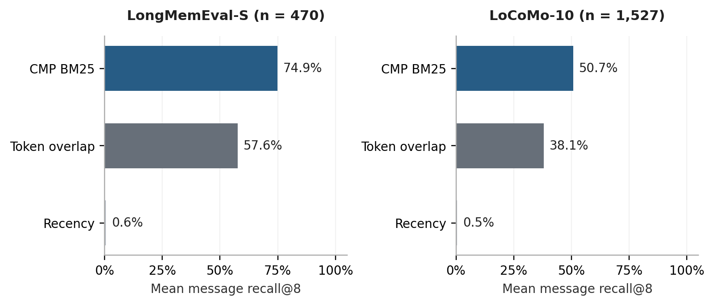
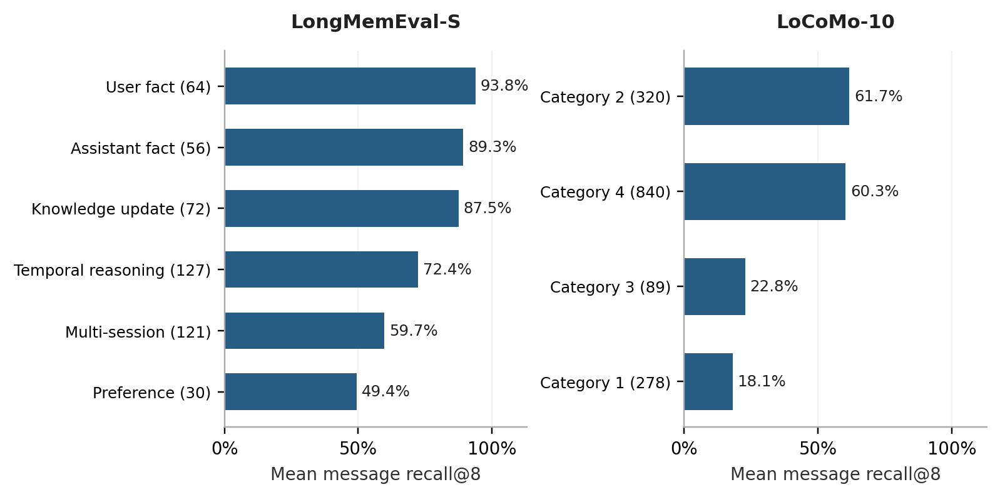
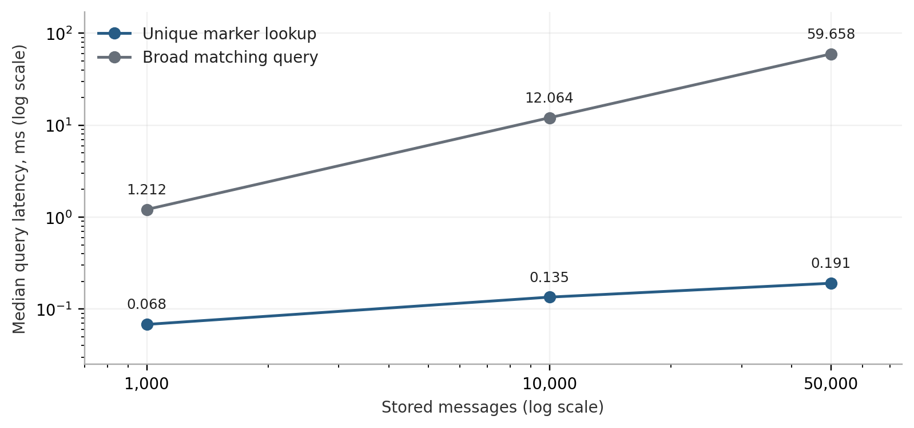

# Context Memory Path: Durable Task State and Evidence Retrieval

## Abstract

Agent memory must preserve both evidence and the state of ongoing work. Returning the correct source excerpt does not, by itself, resume the correct task or restore its planner state. Context Memory Path (CMP) 0.3 is a local Python component that separates these operations through explicit task addresses, dependency scopes, source-linked fact revisions and bounded context packages. A new SQLite implementation replaces a transient research prototype with committed writes, searchable original messages, standalone backups and a command-line interface. Evaluation spans 1,997 scored public-benchmark questions, producing 5,991 method-query observations, together with 320 operational probes and 300 scaling queries. SQLite BM25 achieves mean annotated-message recall at eight retrieved messages of 74.9% on cleaned LongMemEval-S and 50.7% on LoCoMo-10, compared with 57.6% and 38.1% for unique-token overlap. These gains support using a stronger lexical ranker; they do not establish a graph-specific advantage. Forty-two automated tests cover the implementation and evaluation boundary. Registered aliases and explicit addresses resolve reliably in the constructed task study, while unsupported paraphrases remain unresolved. The release is an inspectable task-memory component with a reproducible retrieval baseline. Generated-answer quality, autonomous task discovery and semantic paraphrase robustness remain unmeasured.

## 1. Problem and contribution

Consider an assistant that drafts a report, creates two invoices from it, switches to an unrelated article and later resumes the second invoice. Several distinct failures are possible. A retrieved excerpt can contain the correct budget while the active planner still points to the article. A summary can retain an old budget after a correction. A context assembler can count selected text while omitting message framing or the latest query from its size calculation. Durable storage, useful retrieval and correct work resumption require separate contracts.

The task-path formulation is motivated by the supplied CMP research materials and the public CMP module in Evonic. This implementation is an independent extension of that idea, not a reproduction of Evonic's complete agent runtime or its reported model-performance curves.[^1] The central design decision is to make task creation, evidence insertion, task resolution, state activation and context construction separately observable operations. Each operation exposes an outcome that can be validated without assuming an intelligent language-model reader.

This separation addresses a practical product need: an application may already know its project or workflow boundaries and still need dependable memory. In that setting, requiring an LLM to infer every boundary adds an unnecessary source of uncertainty. The application can provide task IDs directly, retain original evidence and decide when a returned planner snapshot should become active. A language-based classifier can be added above this interface, but its errors should remain distinguishable from storage and retrieval errors.

The contribution is therefore a software artifact and a bounded empirical study. It consists of a durable task-memory API, explicit source and revision semantics, a tested complete-payload budget contract and an evaluation that preserves the boundary between retrieval labels and model inputs. It does not propose a new BM25 algorithm, claim the first graph memory for agents or demonstrate that a small model matches a larger model. Long-context access itself is not a sufficient reason to expect reliable evidence use, as earlier work on position sensitivity has shown.[^3]

## 2. Relationship to prior work

MemGPT treats limited model context through movement between memory tiers and explicit control flow. Its contribution already establishes memory management as a runtime concern beyond a single prompt.[^2] CMP adopts a narrower interface: work is addressed by task, and the host application explicitly commits state transitions. The distinction is an implementation contract, not a claim that task memory replaces hierarchical memory management.

A-MEM organizes memories as linked notes and allows relationships to evolve. Zep models temporally structured knowledge, and Mem0 extracts and consolidates salient information from interactions.[^8][^9][^10] These systems make a broad claim that retrieval systems cannot preserve relationships untenable. CMP's dependency graph records application-supplied task relationships; its fact ledger records caller-assigned revisions. Neither structure automatically produces a semantically correct interpretation of arbitrary conversation.

Recent work reinforces the need to distinguish memory representation from the reading process. Agent Zero Memory combines several forms of source-aware memory, while LazyMem explores query-time selective construction of a compact memory from retrieved candidates.[^11][^12] Those papers contain their authors' own model and cost results. The present experiment does not reproduce their readers, training procedures or protocols, so their headline percentages are not plotted beside CMP's retrieval measurements.

LongMemEval separates indexing, retrieval and reading, and its official tooling distinguishes retrieval metrics from generated-answer accuracy.[^4] That separation directly shapes this evaluation. LoCoMo contributes sustained conversation histories and evidence references, although its released ten-conversation subset and its question categories differ from LongMemEval.[^6][^7] Scores must retain those dataset and protocol differences.

LongMemEval-V2 is also relevant to the next research step. Its official 2026 repository describes trajectory-based memory across web and enterprise environments, including dynamic state and workflow knowledge.[^13] It is closer to experienced task execution than a short exact-identifier recall probe. This release evaluates the cleaned original LongMemEval-S data, not V2, and makes no claim about the latter's multimodal trajectories or leaderboard tiers.

| Design concern | Established related direction | CMP 0.3 implementation |
| --- | --- | --- |
| Context management | Memory tiers and retrieval | Persistent originals and counted selection |
| Relationships | Linked notes and knowledge graphs | Caller-supplied task dependencies |
| Change over time | Temporal knowledge and consolidation | Sourced, task-scoped fact revisions |
| Source fidelity | Provenance-aware memory | Immutable messages and internal citations |
| Work resumption | Agent control and workflow memory | Explicit resolve/resume separation |

## 3. System design

### 3.1 Durable records and task scope

The new runtime stores tasks, dependency edges, aliases, original messages, fact revisions and state events in one SQLite database. A task has an immutable numeric identifier, title, status, parent references and a versioned JSON planner snapshot. Parents must exist before a new child is created; this creates a directed acyclic dependency structure. Two invoices can share the report as parent without making one invoice depend on the other.

Original messages are not deleted when a prompt omits them. Archiving changes a task's visibility in the open-task list while preserving searchability and its planner snapshot. Explicit deletion removes a leaf task and its associated current database records, including full-text index entries. Task and message IDs are not reused after committed deletion. Existing backup files are separate artifacts and are not rewritten by deletion.

The default context scope contains the selected task and up to three ancestor hops. A task-only scope provides stricter separation, and global recall is an explicit option. Scope is supplied by the application; successful exclusion of unrelated tasks is not evidence of automatic semantic understanding. A flat store with equivalent task IDs and filters can provide the same basic isolation.

### 3.2 Resolution and resumption

`resolve(query)` recognizes an explicit task ID, a whole task-title phrase or a registered alias. It returns one of three states: resolved, ambiguous or not found. If multiple tasks match, it returns candidates without selecting one. An unknown explicit ID remains unresolved. Unsupported paraphrases are not silently treated as successful matches.

Resolution is a read. `resume(task_id)` is the separate write that changes the active task and returns its saved planner snapshot. This prevents retrieval from silently changing the host application's work state. Optional expected-version checks detect contested state changes, while snapshot revisions provide a similar check for planner updates. These checks prevent a stale write from overwriting a newer state without making the state conflict visible.

### 3.3 Evidence, revisions and provenance

Every stored message retains its role, full content, caller-supplied source metadata and UTC insertion time. A citation such as `T3:M12` identifies a concrete message in a concrete task. It establishes the origin of the stored assertion, not whether the assertion is correct. An assistant-generated response remains assistant-origin evidence even when later retrieved.

Structured facts are explicit key/value assignments from the caller. Each revision must cite evidence from the same task, and earlier revisions remain readable. A retraction is stored explicitly rather than being conflated with a missing key. Revision order is recording order; the implementation is not a general bitemporal database and does not infer event chronology from natural language.

Fact and source admission are coupled during context construction. A fact field is included only together with its cited original message. Retained old statements can still appear in raw evidence, so a reader may need to interpret a correction or conflict. The system does not claim that citations make false statements true or that a revision record guarantees a model will obey the latest update.

### 3.4 Retrieval and the budget contract

The search index uses SQLite FTS5 with its built-in BM25 ranker. Query terms are Unicode words with a fixed English stop-word list. Terms are escaped into a literal OR query, with no stemming, learned embedding or semantic expansion. FTS5's BM25 uses fixed k1=1.2 and b=0.75 and returns smaller internal values for better matches; the API exposes the negated score so higher is better.[^14]

Context construction reserves mandatory system instructions, a memory envelope and the complete current query. Optional task metadata, fact/source pairs, ranked evidence and recent messages are admitted as complete atoms while the serialized message list remains within the allowance. An oversized atom is skipped so it does not prevent a later smaller candidate from fitting. The stored original remains intact.

The contract is **count(package.as_messages()) <= budget - reserve**. The default count is an estimate based on characters divided by four with message framing. A caller can instead provide a deterministic counter for the complete serialized message list. Tests also use exact UTF-8 byte counts to validate the contract independently of the heuristic. Tool schemas, provider-specific framing and output capacity must be included in a custom accounting scheme or explicitly reserved by the host application.

Quoted evidence is placed in a user-role data envelope, not promoted into the system instruction string. This placement is tested as a payload property. It does not constitute a demonstrated defense against prompt injection in an actual language model.

## 4. Evaluation design

### 4.1 Questions and datasets

Three questions guide the evaluation. Does an indexed lexical ranker retrieve more annotated evidence than a simple overlap baseline? Does explicit task scope preserve state and keep unrelated evidence out of task-specific context? Do the storage and payload contracts survive operational failures and growing histories? A fourth question, whether those properties improve generated answers or completed tasks, remains outside the measured study.

The public retrieval study uses pinned bytes from the cleaned LongMemEval-S dataset and the released LoCoMo-10 file.[^5][^7] It evaluates 470 answerable LongMemEval questions after excluding the 30 abstention questions, following the official retrieval convention. Eleven empty source messages are skipped. Every scored LongMemEval question has at least one annotated message target.

LoCoMo's released file contains 1,986 question entries. Excluding 446 category-5 questions leaves 1,540, of which four have no evidence references and nine have at least one unresolved reference. The remaining 1,527 questions are scored. A question with incomplete references is excluded as a whole, rather than having missing targets silently removed from its recall denominator. The resulting subset may still be easier than all released entries, so these exclusions limit the claim.

The independent corpus unit is an original message for LongMemEval and a speaker turn for LoCoMo. Source text alone enters the lexical index. Session dates and speaker metadata are stored but do not affect ranking. Generated summaries, observations, question answers and evidence labels are excluded from the index. Dataset-supplied session boundaries become storage tasks; the study does not measure task-boundary detection or global multi-user retrieval.

### 4.2 Controlled baselines and leakage boundary

Recency returns the most recent messages. Token overlap ranks messages by the number of unique query terms shared with their content, breaking ties by recency. CMP BM25 uses the product's indexed search over the same source atoms. No aliases, extracted facts or learned models are supplied in this public-data comparison. Each method receives the question, not its expected answer.

The benchmark retrieves up to 32 candidates and records recall at eight and twenty messages. It also packs candidates into a common retrieval-only evidence envelope under 2,000 estimated input units. The full query and source metadata are counted for every method. Whole messages that do not fit are skipped. This common packer isolates ranking from CMP's task/fact-aware context policy, which is validated separately in the operational study.

Gold annotations are used only after ranking and packing. A regression test inserts an expected answer that appears nowhere in the source and verifies that it is absent from exported prompts. Another distinguishes partial recall from complete target coverage. The first public run stopped on an empty input message; the adapter was corrected and the complete experiment restarted without changing retrieval parameters. The local analysis plan and this deviation are preserved in the research package.

### 4.3 Metrics and uncertainty

For each question, message recall is the number of retrieved annotated messages divided by the number of annotated messages. The reported mean gives equal weight to each question. All-gold success requires every annotated message to be present. Session recall counts annotated source sessions represented among the top eight messages; it is not recall at eight independently retrieved sessions. Packed recall applies the same message-target definition after context admission.

Paired bootstrap intervals describe the BM25-minus-baseline difference in mean recall at eight messages. There are 2,000 resamples with seed 20260910. LoCoMo resamples whole conversations because questions share histories. LongMemEval resamples question instances, although shared filler sessions weaken independence assumptions. The intervals describe these benchmark samples and are not estimates of performance across all real users.

Indexing, ranker query time and packing are timed separately. Overlap's message-token preparation is outside its timed ranker section, so its reported query timing is not total uncached preprocessing cost. No timing is presented as model inference latency. All measured prompt sizes use the stated estimator rather than a production tokenizer.

## 5. Public retrieval results

### 5.1 Overall evidence recovery

The evaluation produces 5,991 method-query rows: three methods across 1,997 scored questions. The BM25 ranker improves annotated-message recall at eight messages on both datasets. Recency performs poorly because relevant evidence is commonly outside the last few turns. These results support indexed lexical retrieval over a fixed short tail and over an unweighted overlap ranker.

| Dataset and method | Recall@8 | Recall@20 | All gold@8 | Packed recall |
| --- | ---: | ---: | ---: | ---: |
| LongMemEval: recency | 0.6% | 4.6% | 0.4% | 1.0% |
| LongMemEval: overlap | 57.6% | 71.6% | 44.9% | 57.5% |
| LongMemEval: BM25 | 74.9% | 83.7% | 65.3% | 74.3% |
| LoCoMo: recency | 0.5% | 2.4% | 0.5% | 2.5% |
| LoCoMo: overlap | 38.1% | 46.0% | 35.5% | 45.1% |
| LoCoMo: BM25 | 50.7% | 59.8% | 46.7% | 60.2% |

**Figure 1.** Mean annotated-message recall at eight retrieved messages. LongMemEval has 470 scored questions; LoCoMo has 1,527. The chart compares rankers over the same source units. It does not measure generated answers.

The paired BM25 improvement over overlap is 17.35 percentage points on LongMemEval, with a bootstrap interval of 14.55 to 20.33 points. On LoCoMo it is 12.62 points, with a conversation-clustered interval of 10.05 to 15.19 points. These are relative method differences in percentage points, not percentage increases in answer accuracy.

Full evidence coverage remains substantially below perfect. BM25 retrieves all annotated messages within its top eight for 307 of 470 LongMemEval questions and 713 of 1,527 LoCoMo questions. It retrieves none of the annotated messages for 71 LongMemEval questions and 674 LoCoMo questions. Every scored query returns some lexical hits, so a nonempty result set is not a reliable abstention criterion.

### 5.2 Context admission and category differences

Under the common 2,000-unit envelope, BM25's mean packed recall is 74.3% on LongMemEval and 60.2% on LoCoMo. The highest measured packed size is exactly 2,000; no constrained payload exceeds its budget. Full packed coverage is 307 of 470 and 838 of 1,527, respectively. LoCoMo's packed recall exceeds recall@8 because its short conversational turns allow more than eight candidates to fit.

The corresponding top-eight-message session recall is 89.6% on LongMemEval and 82.0% on LoCoMo. Those higher values show why a session hit alone can conceal missing evidence within the session. They cannot be read as the fraction of questions correctly answered.

LongMemEval's BM25 recall@8 ranges from 93.8% for single-session user questions to 49.4% for preference questions. Multi-session questions reach 59.7%, below the overall mean. Knowledge-update questions reach 87.5% retrieval recall, but that result does not establish that a reader chooses the current value over an old one. LoCoMo category 1 has only 18.1% message recall, compared with 60.3% for category 4.

**Figure 2.** BM25 mean message recall@8 by released question category. LoCoMo category numbers are retained to avoid conflating its taxonomy with LongMemEval's. Denominators are printed beside category labels. Category results are descriptive and were not used to tune the ranker.

These gaps are consistent with the limitations of surface-form retrieval: a question may use different vocabulary, require several scattered facts, identify a speaker through metadata, or rely on an implicit preference. The present measurements do not establish which cause accounts for each failure. Speaker and date metadata are preserved but not indexed, and image-derived information is not inferred. Metadata-aware indexing, learned retrieval and semantic query expansion are plausible experiments, not measured improvements in this release.

## 6. Operational behavior and scale

### 6.1 State restoration and scope

The task-state study creates 40 seeded databases with twelve tasks each, overlapping budget keys and two revisions per task. It performs 320 probes across eight conditions. Explicit task IDs and registered aliases each resolve to the intended task in 40 of 40 probes. Forty intentionally ambiguous aliases and forty absent task IDs produce no false resolutions. Resolution leaves active state unchanged in all 200 resolution probes.

The forty answerable but unregistered paraphrases produce zero resolved targets. That is a coverage failure, even though abstaining is preferable to an unsupported switch. Across the three answerable query conditions, coverage is therefore 80/120, with 80/80 correct among resolved cases. This operational study cannot support a claim of general paraphrase understanding.

| Operational condition | Measured result |
| --- | --- |
| Explicit ID resolution | 40/40 correct |
| Registered alias resolution | 40/40 correct |
| Unregistered paraphrase resolution | 0/40 resolved |
| Ambiguous or absent target | 0/80 false resolutions |
| Planner snapshot resumption | 40/40 restored |
| Task-scoped context | Latest revision in 40/40; zero unrelated evidence |
| Global context | Latest revision in 40/40; mean 22 unrelated messages |

Task-only contexts include the latest assigned budget revision in every probe and exclude unrelated task messages. The global variant also includes the latest revision but admits an average of 22 unrelated messages. This is a direct result of the caller-supplied filter; it is not an automatic-routing benchmark or proof that a graph is required for isolation. Both variants remain within the configured input bound.

### 6.2 Storage and local performance

Forty-two automated tests pass on Python 3.12. They cover reopened databases, standalone backups, nested rollback, denied-commit rollback, foreign-task fact references, stale state updates, deletion/index agreement, unknown database rejection, exact counted payloads and version-2 checkpoint migration. A randomized 160-step interleaving test compares stored values with a separate reference dictionary across repeated reopenings. These are targeted software checks, not a quantified guarantee against all failures.

The scaling study measures 100 queries at each of 1,000, 10,000 and 50,000 messages, split equally between a unique marker lookup and a broad query shared by most records. Timings follow fixed warmups and use one local runtime. Bulk ingestion is a single transaction per size, so ingestion timings do not represent the cost of committing every message individually.

| Messages | Selective median | Broad median | Broad sampled p95 | Database and journals |
| --- | ---: | ---: | ---: | ---: |
| 1,000 | 0.068 ms | 1.212 ms | 1.349 ms | 0.56 MB |
| 10,000 | 0.135 ms | 12.064 ms | 12.975 ms | 3.91 MB |
| 50,000 | 0.191 ms | 59.658 ms | 62.841 ms | 40.64 MB |

**Figure 3.** Median lexical search latency for selective and broad synthetic queries. Axes use logarithmic scaling. The corpus contains 100 tasks; each point summarizes 50 timed queries of that kind. Database sizes include live journals and are not per-record steady-state compression estimates.

Selective lookups remain below one millisecond in this microbenchmark, but broad-query cost rises markedly with corpus size. The result contradicts an unqualified constant-latency claim. Public-data median BM25 query times are approximately 1.20 ms for LongMemEval and 0.90 ms for LoCoMo. Median corpus indexing takes about 48.0 ms and 34.6 ms respectively, on separate in-memory corpora. These timings exclude model generation, network calls and benchmark scoring.

## 7. Validity, negative results and claim boundaries

The strongest supported conclusion is that the release offers explicit, inspectable task-state and evidence contracts, with a lexical ranker that outperforms two simple controls on the stated retrieval tasks. The public-data ranker is graph-free: adding a task graph does not explain its global BM25 gain. The operational scope study verifies an application-provided boundary. It does not show that CMP discovers those boundaries from a natural conversation.

The study uses no learned embedding baseline, reranker, generative summary baseline or live reader. Its percentages therefore cannot establish superiority over A-MEM, Zep, Mem0, Agent Zero Memory or commercial assistants. Different datasets, retrieval units, prompts, reader models and judges would make such a comparison invalid. Retrieval failure does not always force answer failure, and complete retrieval does not guarantee a correct answer.

The public datasets contain constructed histories and are not a random sample of production use. LoCoMo has only ten conversation clusters, limiting the stability of its clustered uncertainty estimates. LongMemEval cases can share filler sessions. Dataset-provided boundaries, text-only indexing and whole-message admission restrict the evaluation. There was no held-out model training stage because no parameters were learned; the local analysis plan is not an external preregistration.

The budget guarantee is relative to the supplied count function. It is not a claim that character estimates equal provider tokens. Similarly, SQLite persistence and local locking do not make this an authenticated multi-tenant service. Storage and fact-history size grow with use. Platform validation is limited to the reported environment, and the fault tests do not simulate power loss, every filesystem failure or all concurrent workloads.

Unsupported paraphrases remain a visible product limitation. Adding a known alias can make a particular phrase resolvable, but registering aliases after reading test answers would be evaluation leakage. No aliases were added for public questions. General semantic routing needs its own labeled, held-out task-intent evaluation with both coverage and false-switch metrics.

## 8. Release artifact and subsequent experiments

The distribution contains the `TaskMemory` Python API, the `cmpath` CLI, a standalone example, API and integration documentation, a checkpoint migration utility, tests and reproducible benchmark adapters. Wheel and source archives follow standard Python packaging conventions.[^15] The new code is MIT-licensed; upstream Evonic code and the earlier unlicensed archive are not bundled. External datasets are obtained separately under their original terms. The accompanying workbook exposes the numerical observations behind the charts.

Version 0.3.0rc1 is a release candidate for developer evaluation. It is not a declaration of journal acceptance, production service certification or package-index publication. The supplied executable generation runner can send exact exported prompts to a caller-configured model endpoint, but no model endpoint was configured for the reported study. Its presence is an integration artifact, not an inference result.

The next consequential experiment should hold the retrieved evidence, reader version, tokenizer, output allowance and scoring protocol constant while varying task-state metadata. Measure correct task activation, snapshot restoration, generated-answer accuracy and completed actions separately. A matched flat task-ID store is necessary to determine whether dependency structure adds value beyond simple filtering. Record construction cost, retrieval cost, reader tokens and judge cost independently.

For semantic retrieval, compare an independently specified embedding model, BM25 and a hybrid ranker on held-out questions. Include conflicting updates, missing evidence, multilingual references and ambiguous task names. Treat an abstention as reduced coverage on answerable queries, and report false resolutions on unanswerable or ambiguous ones. Task execution should then be tested on an appropriate trajectory benchmark, including the newer LongMemEval-V2 setting where feasible, before claims expand from evidence retrieval to experienced agent behavior.[^13]

## Sources

1. Robin Syihab and Evonic contributors. [Evonic CMP source module](https://github.com/anvie/evonic/tree/bafbe2a6183fb672bddbc18abc21cd49e4066e47/backend/agent_runtime/cmp). Pinned revision bafbe2a6183fb672bddbc18abc21cd49e4066e47, 2026.

2. Charles Packer et al. [MemGPT: Towards LLMs as Operating Systems](https://arxiv.org/abs/2310.08560). 2023; revised 2024.

3. Nelson F. Liu et al. [Lost in the Middle: How Language Models Use Long Contexts](https://arxiv.org/abs/2307.03172). 2023.

4. Di Wu et al. [LongMemEval: Benchmarking Chat Assistants on Long-Term Interactive Memory](https://arxiv.org/html/2410.10813v2). ICLR 2025.

5. LongMemEval maintainers. [LongMemEval cleaned dataset and official evaluation repository](https://huggingface.co/datasets/xiaowu0162/longmemeval-cleaned/tree/98d7416c24c778c2fee6e6f3006e7a073259d48f). 2025 cleanup; accessed 10 September 2026.

6. Adyasha Maharana et al. [Evaluating Very Long-Term Conversational Memory of LLM Agents](https://arxiv.org/abs/2402.17753). ACL 2024.

7. Snap Research and LoCoMo contributors. [LoCoMo public data and code](https://github.com/snap-research/locomo/tree/3eb6f2c585f5e1699204e3c3bdf7adc5c28cb376). 2024 release; pinned repository revision.

8. Wujiang Xu et al. [A-MEM: Agentic Memory for LLM Agents](https://arxiv.org/abs/2502.12110). 2025.

9. Preston Rasmussen et al. [Zep: A Temporal Knowledge Graph Architecture for Agent Memory](https://arxiv.org/abs/2501.13956). 2025.

10. Prateek Chhikara et al. [Mem0: Building Production-Ready AI Agents with Scalable Long-Term Memory](https://arxiv.org/abs/2504.19413). 2025.

11. Ming Wu and Pengyuan Zhu. [Agent Zero Memory: Provenance-Aware Long-Term Memory for LLM Agents](https://arxiv.org/abs/2608.29606). 30 August 2026 preprint.

12. Jing Yu et al. [LazyMem: Retrieve Broadly, Construct Selectively for Efficient Long-Term Agent Memory](https://arxiv.org/abs/2607.22690). July 2026 preprint.

13. Di Wu et al. [LongMemEval-V2: Evaluating Long-Term Agent Memory Toward Experienced Colleagues](https://github.com/xiaowu0162/LongMemEval-V2). 2026 official repository.

14. SQLite project. [SQLite FTS5 Extension](https://sqlite.org/fts5.html). Documentation, accessed 10 September 2026.

15. Python Packaging Authority. [Packaging Python Projects](https://packaging.python.org/en/latest/tutorials/packaging-projects/). Documentation, accessed 10 September 2026.

[^1]: Robin Syihab and Evonic contributors. [Evonic CMP source module](https://github.com/anvie/evonic/tree/bafbe2a6183fb672bddbc18abc21cd49e4066e47/backend/agent_runtime/cmp). Pinned revision bafbe2a6183fb672bddbc18abc21cd49e4066e47, 2026.
[^2]: Charles Packer et al. [MemGPT: Towards LLMs as Operating Systems](https://arxiv.org/abs/2310.08560). 2023; revised 2024.
[^3]: Nelson F. Liu et al. [Lost in the Middle: How Language Models Use Long Contexts](https://arxiv.org/abs/2307.03172). 2023.
[^4]: Di Wu et al. [LongMemEval: Benchmarking Chat Assistants on Long-Term Interactive Memory](https://arxiv.org/html/2410.10813v2). ICLR 2025.
[^5]: LongMemEval maintainers. [LongMemEval cleaned dataset and official evaluation repository](https://huggingface.co/datasets/xiaowu0162/longmemeval-cleaned/tree/98d7416c24c778c2fee6e6f3006e7a073259d48f). 2025 cleanup; accessed 10 September 2026.
[^6]: Adyasha Maharana et al. [Evaluating Very Long-Term Conversational Memory of LLM Agents](https://arxiv.org/abs/2402.17753). ACL 2024.
[^7]: Snap Research and LoCoMo contributors. [LoCoMo public data and code](https://github.com/snap-research/locomo/tree/3eb6f2c585f5e1699204e3c3bdf7adc5c28cb376). 2024 release; pinned repository revision.
[^8]: Wujiang Xu et al. [A-MEM: Agentic Memory for LLM Agents](https://arxiv.org/abs/2502.12110). 2025.
[^9]: Preston Rasmussen et al. [Zep: A Temporal Knowledge Graph Architecture for Agent Memory](https://arxiv.org/abs/2501.13956). 2025.
[^10]: Prateek Chhikara et al. [Mem0: Building Production-Ready AI Agents with Scalable Long-Term Memory](https://arxiv.org/abs/2504.19413). 2025.
[^11]: Ming Wu and Pengyuan Zhu. [Agent Zero Memory: Provenance-Aware Long-Term Memory for LLM Agents](https://arxiv.org/abs/2608.29606). 30 August 2026 preprint.
[^12]: Jing Yu et al. [LazyMem: Retrieve Broadly, Construct Selectively for Efficient Long-Term Agent Memory](https://arxiv.org/abs/2607.22690). July 2026 preprint.
[^13]: Di Wu et al. [LongMemEval-V2: Evaluating Long-Term Agent Memory Toward Experienced Colleagues](https://github.com/xiaowu0162/LongMemEval-V2). 2026 official repository.
[^14]: SQLite project. [SQLite FTS5 Extension](https://sqlite.org/fts5.html). Documentation, accessed 10 September 2026.
[^15]: Python Packaging Authority. [Packaging Python Projects](https://packaging.python.org/en/latest/tutorials/packaging-projects/). Documentation, accessed 10 September 2026.
